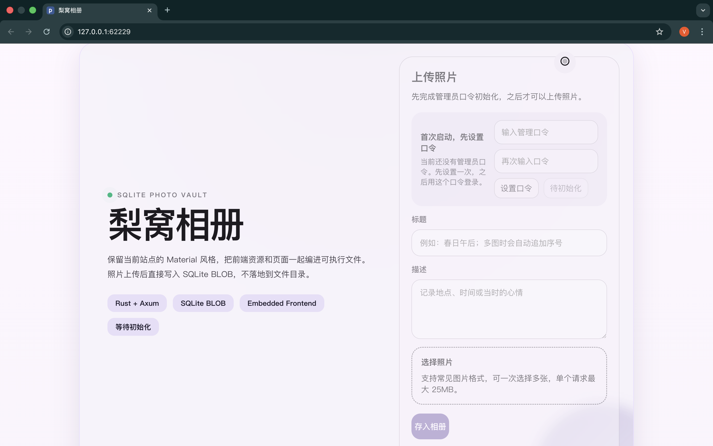

# Lily Photos / 梨窝相册

>  **该项目fork自[lily-nest](https://github.com/Sulytwelve/lily-nest)魔改**

`lily-photos` 是一个基于 Rust、Axum 和 SQLite 的本地相册应用。它把前端页面、样式和脚本直接嵌入可执行文件，启动后即可在浏览器中使用；上传的图片会经过压缩处理后写入 SQLite 数据库，不依赖额外的静态文件目录。



这个仓库目前的实际代码已经不是“个人主页 / 项目展示站”，而是一个单机相册程序。下面的说明基于当前源码重新整理。

## 功能概览

- 首次启动时在页面内设置管理员口令
- 通过 Cookie 进行管理登录 / 退出
- 支持多图上传
- 上传时自动缩放和 JPEG 压缩，减小数据库体积
- 照片、标题、描述、标签统一存入 SQLite
- 按日期时间线展示照片
- 支持编辑标题、描述、标签
- 支持删除照片
- 内置浅色 / 深色 / 跟随系统主题
- 前端资源内嵌，无需额外前端构建步骤
- 支持 macOS `.app` 打包和 Windows 交叉编译脚本

## 技术栈

- Rust 2024
- Axum 0.8
- Tokio
- Rusqlite + SQLite
- image
- 原生 HTML / CSS / JavaScript（通过 `include_str!` / `include_bytes!` 内嵌）

## 运行方式

### 开发运行

```bash
cargo run
```

启动后程序会：

- 初始化 SQLite 数据库
- 自动绑定一个本地随机端口
- 输出访问地址
- 在支持的系统上尝试自动打开浏览器

默认情况下：

- macOS 数据库位置：`~/Library/Application Support/LilyNest/gallery.sqlite3`
- 其他系统默认数据库位置：可执行文件同目录下的 `gallery.sqlite3`

### 环境变量

- `LILY_NEST_DB_PATH`
  自定义 SQLite 数据库文件路径
- `LILY_NEST_TLS_CERT`
  TLS 证书文件路径；与 `LILY_NEST_TLS_KEY` 同时设置时启用 HTTPS
- `LILY_NEST_TLS_KEY`
  TLS 私钥文件路径

启用 TLS 后，程序监听 `8443` 端口；未启用时监听本地随机端口。

## 当前 API

所有接口前缀均为 `/api/v1`。

- `GET /health`
  健康检查
- `GET /auth/status`
  获取登录状态和是否需要初始化口令
- `POST /auth/setup`
  首次设置管理员口令
- `POST /auth/login`
  管理员登录
- `POST /auth/logout`
  管理员退出
- `GET /photos`
  获取照片列表
- `POST /photos`
  上传照片，需要管理员登录
- `PATCH /photos/{id}`
  修改照片标题 / 描述 / 标签，需要管理员登录
- `DELETE /photos/{id}`
  删除照片，需要管理员登录
- `GET /photos/{id}/content`
  获取照片原始内容

## 项目结构

```text
lily-nest/
├── Cargo.toml
├── Cargo.lock
├── AppIcon.png
├── embedded/
│   ├── app.css
│   ├── app.js
│   └── index.html
├── scripts/
│   ├── build_macos_app.sh
│   └── build_windows_release.sh
├── src/
│   ├── app.rs
│   ├── auth.rs
│   ├── db.rs
│   ├── main.rs
│   ├── media.rs
│   ├── model.rs
│   └── routes/
│       ├── api.rs
│       └── mod.rs
└── static/
    └── images/
        └── favicon.svg
```

### 关键模块说明

- `src/main.rs`
  启动入口、数据库路径选择、TLS 启动逻辑、自动打开浏览器
- `src/app.rs`
  Axum 应用组装、主页和内嵌资源路由、安全响应头
- `src/routes/api.rs`
  鉴权、上传、列表、编辑、删除、图片内容接口
- `src/db.rs`
  SQLite 初始化与数据读写
- `src/media.rs`
  图片缩放、透明背景铺白、JPEG 压缩
- `embedded/`
  当前实际生效的前端资源

## 打包

### macOS App

```bash
./scripts/build_macos_app.sh
```

输出目录：

```text
dist/Lily Nest.app
```

脚本会自动：

- 构建 release 二进制
- 生成 `.app` 目录结构
- 复制可执行文件
- 如果存在 `AppIcon.png` 或 `AppIcon.icns`，则写入应用图标

### Windows 交叉编译

```bash
./scripts/build_windows_release.sh
```

脚本依赖：

- `rustup target add x86_64-pc-windows-gnu`
- 本机安装 `mingw-w64`

## 安全与使用注意

- 当前管理员口令直接保存在 SQLite 的 `app_settings` 表中，不是哈希存储
- 登录 session 只保存在进程内存中，程序重启后需要重新登录
- 更适合本机或受信任内网环境，不建议直接作为公网生产相册服务
- 上传请求体限制为 25 MB

## 测试

```bash
cargo test
```

当前仓库内已有的单元测试会校验安全响应头是否正确写入。

## License

MIT
